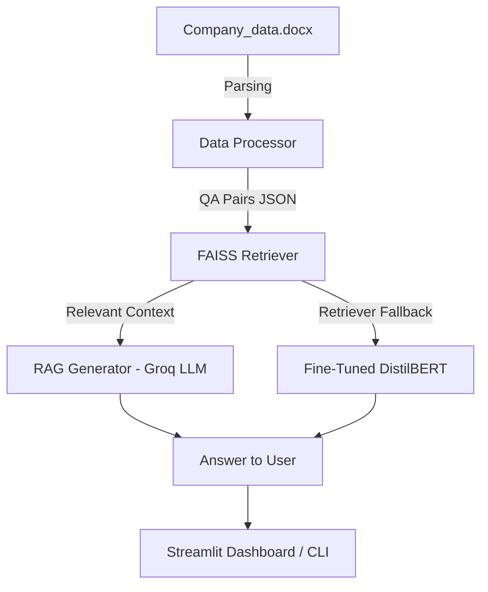

---

# 📊 Financial Q\&A Assistant — Globex Innovations

## 🚀 Project Overview

This project was built to answer **financial questions** on *Globex Innovations’ 2023–2024 data*.

We wanted to explore two different approaches for Q\&A systems:

1. **RAG (Retrieval-Augmented Generation)**

   * Uses **FAISS** to search through stored Q\&A pairs
   * Passes relevant chunks into **Groq LLM (`llama-3.1-8b-instant`)** for response generation

2. **Fine-Tuned DistilBERT QA**

   * A lighter model fine-tuned directly on company-specific Q\&A pairs
   * Works offline, and if the fine-tuned model isn’t available, it falls back to retrieval mode

On top of this, we also built a **Streamlit dashboard** so everything can be tested interactively (not just via CLI).

---

## 🏗️ How It Works (Architecture)



---

## 📂 Project Structure

```
project/
│── app.py                  # CLI tool for Q&A
│── streamlit_app.py        # Streamlit dashboard
│── config.py               # Paths, API keys, model configs
│── requirements.txt        # Dependencies
│── README.md               # This file :)
│
├── data/
│   ├── raw/
│   │   └── Company_data.docx
│   └── processed/
│       └── qa_pairs.json
│
├── rag_system/
│   ├── data_processor.py   # Convert docx → Q&A JSON
│   ├── retriever_faiss.py  # FAISS-based retriever
│   └── generator.py        # Groq LLM answer generation
│
├── fine_tuned_system/
│   └── model.py            # Fine-tuned DistilBERT (or retriever fallback)
│
└── fine_tuning/
    └── fine_tune_bert.ipynb  # Notebook for fine-tuning DistilBERT
```

---

## ⚙️ Setup

### 1. Clone & create environment

```bash
git clone <repo_url>
cd project
python -m venv venv
source venv/bin/activate   # Windows: venv\Scripts\activate
pip install -r requirements.txt
```

### 2. Add Groq API key

```bash
# Windows (PowerShell)
setx GROQ_API_KEY "your_api_key_here"

# Linux / Mac
export GROQ_API_KEY="your_api_key_here"
```

### 3. Prepare data

Put your financial data in:

```
data/raw/Company_data.docx
```

Then preprocess it:

```bash
python -m rag_system.data_processor
```

---

## ▶️ Run the Project

### CLI mode

```bash
python app.py
```

### Streamlit dashboard

```bash
streamlit run streamlit_app.py
```

In the UI, you can:

* Type your question
* Select whether to use **RAG** (FAISS + Groq) or **Fine-Tuned DistilBERT**
* See the **answer, confidence score, method used, and response time**
* Expand the retrieved context for debugging

---

## 🧑‍🏫 Fine-Tuning DistilBERT

To fine-tune DistilBERT on your own dataset:

1. Open the notebook:

   ```
   fine_tuning/fine_tune_bert.ipynb
   ```
2. Train on `qa_pairs.json`
3. Save the trained model to:

   ```
   fine_tuned_system/distilbert-qa-lora
   ```

The system will automatically load it. If not found, it falls back to FAISS retrieval.

---

## 🔍 RAG vs Fine-Tuned — What We Learned

| Feature         | RAG (FAISS + Groq)         | Fine-Tuned DistilBERT         |
| --------------- | -------------------------- | ----------------------------- |
| Data Dependency | Uses stored Q\&A chunks    | Learns directly from QA pairs |
| Model Size      | Llama-3.1-8B (Groq)        | DistilBERT (\~66M params)     |
| Response Style  | Conversational, generative | Extractive, precise           |
| External API    | ✅ Needs Groq API           | ❌ Works fully offline         |
| Training Needed | ❌ No training required     | ✅ Needs fine-tuning           |
| Speed           | Medium (API call latency)  | Fast (local inference)        |
| Best Use Case   | General reasoning          | Domain-specific answers       |

---

## 🛠️ Tech Stack

* **LLMs:** Groq LLaMA-3.1, DistilBERT
* **Vector DB:** FAISS (Sentence-Transformers embeddings)
* **Frameworks:** HuggingFace, LangChain, Streamlit
* **Fine-Tuning:** HuggingFace Transformers + PEFT (LoRA)
* **Other tools:** python-docx, scikit-learn, dotenv

---

## 🔮 Next Steps / Improvements

* Add evaluation metrics (Exact Match, F1, BLEU)
* Support for multiple companies/datasets
* Try hybrid retrievers (BM25 + FAISS)
* Deploy via **FastAPI** and package with Docker
* Improve Streamlit UI with charts & retrieval insights

---

## 👥 About Us  

**Conversation AI — Group 77**  

We are a team of **M.Tech students at BITS Pilani**, currently in our **3rd semester** specializing in **Artificial Intelligence and Machine Learning**.  
This project is part of our coursework, where we explore practical applications of **NLP, LLMs, and fine-tuning techniques** in real-world financial Q&A systems.  

---