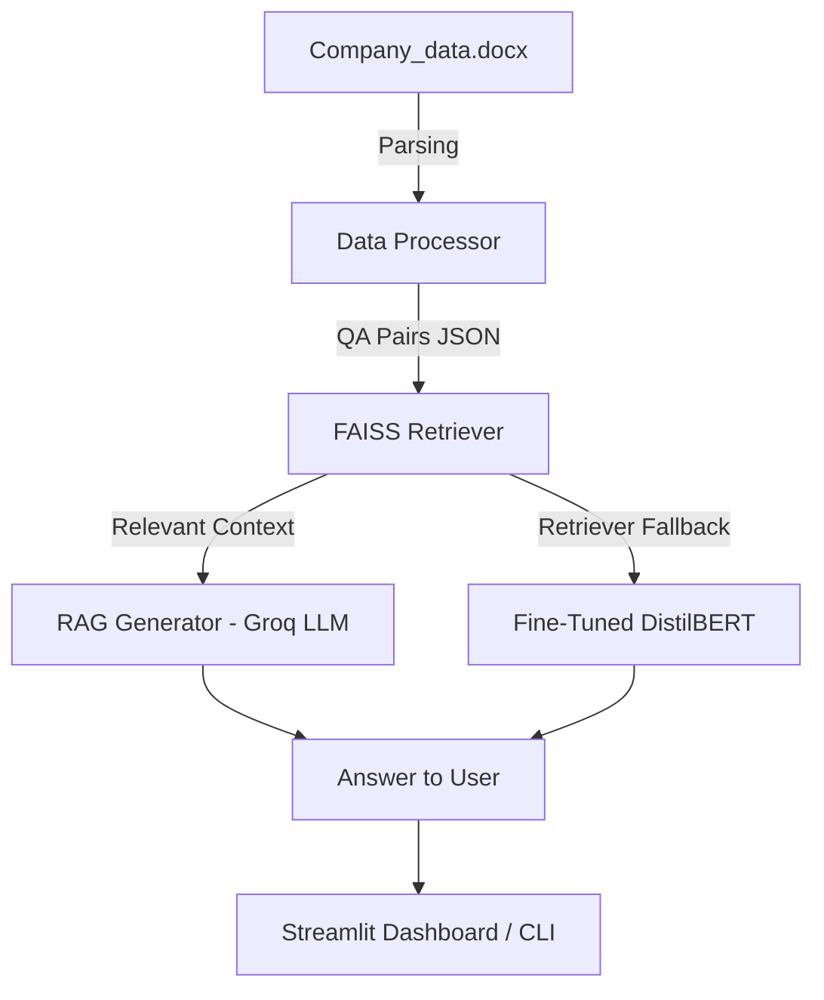

* Clear **overview** of the project
* **Architecture diagram** (text + optional Mermaid for GitHub rendering)
* **Project structure explanation**
* **Setup instructions** (installation, API key, environment)
* **How to run** CLI and Streamlit dashboard
* **Fine-tuning instructions**
* **Comparison between RAG and Fine-tuned approach**
* **Tech stack & dependencies**
* **Future enhancements**
* **Author & credits**

Here’s the full README draft:

---

# 📊 Financial Q\&A Assistant — Globex Innovations

## 🚀 Overview

This project provides **Question Answering (Q\&A)** on financial data (2023–2024) for *Globex Innovations*.
It implements and compares two approaches:

1. **RAG (Retrieval-Augmented Generation)**

   * Uses FAISS for vector similarity search
   * Retrieves the most relevant Q\&A pairs
   * Passes context to **Groq LLM (`llama-3.1-8b-instant`)** for natural answer generation

2. **Fine-Tuned DistilBERT QA**

   * A lightweight QA model fine-tuned on company-specific Q\&A pairs
   * Falls back to retriever mode if fine-tuned model is missing

👉 Includes a **Streamlit dashboard** for interactive queries.

---

## 🏗️ System Architecture



---

## 📂 Project Structure

```
project/
│── app.py                  # CLI interface
│── config.py               # Configurations (paths, API keys, model)
│── requirements.txt        # Dependencies
│── README.md               # Project documentation
│── streamlit_app.py        # Streamlit dashboard
│
├── data/
│   ├── raw/
│   │   └── Company_data.docx
│   └── processed/
│       └── qa_pairs.json
│
├── rag_system/
│   ├── data_processor.py   # Converts docx → Q&A JSON
│   ├── retriever_faiss.py  # FAISS-based retriever
│   └── generator.py        # Groq-powered answer generator
│
├── fine_tuned_system/
│   └── model.py            # Fine-tuned DistilBERT QA model (or fallback retriever)
│
└── fine_tuning/
    └── fine_tune_bert.ipynb  # Notebook for fine-tuning DistilBERT
```

---

## ⚙️ Setup Instructions

### 1. Clone repo & create environment

```bash
git clone <repo_url>
cd project
python -m venv venv
source venv/bin/activate   # Windows: venv\Scripts\activate
pip install -r requirements.txt
```

### 2. Configure Groq API

```bash
# Windows (PowerShell)
setx GROQ_API_KEY "your_api_key_here"

# Linux / Mac
export GROQ_API_KEY="your_api_key_here"
```

### 3. Prepare Data

Place your dataset:

```
data/raw/Company_data.docx
```

Process into Q\&A JSON:

```bash
python -m rag_system.data_processor
```

---

## ▶️ Running the Project

### 1. Run CLI

```bash
python app.py
```

### 2. Run Streamlit Dashboard

```bash
streamlit run streamlit_app.py
```

You’ll get an interactive UI:

* Enter your **question**
* Choose **RAG** (FAISS + Groq LLM) or **Fine-Tuned QA**
* See **Answer + Confidence + Method + Response Time**
* Expand to view retrieved context

---

## 🧑‍🏫 Fine-Tuning DistilBERT

To fine-tune DistilBERT on your dataset:

1. Open notebook:

   ```
   fine_tuning/fine_tune_bert.ipynb
   ```
2. Run training (uses `qa_pairs.json`)
3. Save model to:

   ```
   fine_tuned_system/distilbert-qa-lora
   ```

The system will auto-load this model when available.

If the model is missing, it falls back to FAISS retriever answers.

---

## 🔍 Comparison: RAG vs Fine-Tuned

| Feature         | RAG (FAISS + Groq)          | Fine-Tuned DistilBERT         |
| --------------- | --------------------------- | ----------------------------- |
| Data Dependency | Uses stored Q\&A context    | Learns company-specific QA    |
| Model Size      | Llama-3.1-8B (via Groq API) | DistilBERT (\~66M params)     |
| Response Style  | Conversational, generative  | Extractive, precise           |
| External API    | ✅ Requires Groq API         | ❌ Runs fully offline          |
| Training Needed | ❌ No                        | ✅ Yes (fine-tuning)           |
| Speed           | Medium (API call)           | Fast (local inference)        |
| Adaptability    | General reasoning           | Best for domain-specific data |

---

## 🛠️ Tech Stack

* **LLMs:** Groq LLaMA-3.1, DistilBERT
* **Vector DB:** FAISS (dense embeddings with Sentence-Transformers)
* **Frameworks:** HuggingFace, LangChain, Streamlit
* **Fine-Tuning:** HuggingFace Transformers + PEFT (LoRA)
* **Utilities:** python-docx, scikit-learn, dotenv

---

## 🔮 Future Enhancements

* [ ] Add **evaluation metrics** (Exact Match, F1)
* [ ] Support for **multiple company datasets**
* [ ] Hybrid retriever (**BM25 + FAISS**)
* [ ] Deploy as **FastAPI microservice**
* [ ] Dockerize for production

---
