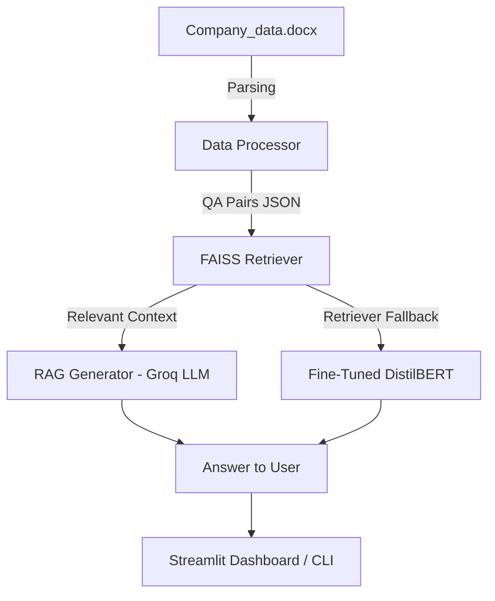

---

# 📊 Financial Q\&A Assistant — Globex Innovations

## 🚀 Project Overview

This project was built to answer **financial questions** on *Globex Innovations’ 2023–2024 data*.

We wanted to explore two different approaches for Q\&A systems:

1. **RAG (Retrieval-Augmented Generation)**

   * Uses **FAISS** to search through stored Q\&A pairs
   * Passes relevant chunks into **Groq LLM (`llama-3.1-8b-instant`)** for response generation

2. **Fine-Tuned DistilBERT QA**

   * A lighter model fine-tuned directly on company-specific Q\&A pairs
   * Works offline, and if the fine-tuned model isn’t available, it falls back to retrieval mode

On top of this, we also built a **Streamlit dashboard** so everything can be tested interactively (not just via CLI).

---

## 🏗️ How It Works (Architecture)



---

## 📂 Project Structure

```
project/
│── app.py                  # CLI tool for Q&A
│── streamlit_app.py        # Streamlit dashboard
│── config.py               # Paths, API keys, model configs
│── requirements.txt        # Dependencies
│── README.md               # This file :)
│
├── data/
│   ├── raw/
│   │   └── Company_data.docx
│   └── processed/
│       └── qa_pairs.json
│
├── rag_system/
│   ├── data_processor.py   # Convert docx → Q&A JSON
│   ├── retriever_faiss.py  # FAISS-based retriever
│   └── generator.py        # Groq LLM answer generation
│
├── fine_tuned_system/
│   └── model.py            # Fine-tuned DistilBERT (or retriever fallback)
│
└── fine_tuning/
    └── fine_tune_bert.ipynb  # Notebook for fine-tuning DistilBERT
```

---

## ⚙️ Setup

### 1. Clone & create environment

```bash
git clone <repo_url>
cd project
python -m venv venv
source venv/bin/activate   # Windows: venv\Scripts\activate
pip install -r requirements.txt
```

### 2. Add Groq API key

```bash
# Windows (PowerShell)
setx GROQ_API_KEY "your_api_key_here"

# Linux / Mac
export GROQ_API_KEY="your_api_key_here"
```

### 3. Prepare data

Put your financial data in:

```
data/raw/Company_data.docx
```

Then preprocess it:

```bash
python -m rag_system.data_processor
```

---

## ▶️ Run the Project

### CLI mode

```bash
python app.py
```

### Streamlit dashboard

```bash
streamlit run streamlit_app.py
```

In the UI, you can:

* Type your question
* Select whether to use **RAG** (FAISS + Groq) or **Fine-Tuned DistilBERT**
* See the **answer, confidence score, method used, and response time**
* Expand the retrieved context for debugging

---

## 🧑‍🏫 Fine-Tuning DistilBERT

To fine-tune DistilBERT on your own dataset:

1. Open the notebook:

   ```
   fine_tuning/fine_tune_bert.ipynb
   ```
2. Train on `qa_pairs.json`
3. Save the trained model to:

   ```
   fine_tuned_system/distilbert-qa-lora
   ```

The system will automatically load it. If not found, it falls back to FAISS retrieval.

---

## 🔍 RAG vs Fine-Tuned — What We Learned

| Feature         | RAG (FAISS + Groq)         | Fine-Tuned DistilBERT         |
| --------------- | -------------------------- | ----------------------------- |
| Data Dependency | Uses stored Q\&A chunks    | Learns directly from QA pairs |
| Model Size      | Llama-3.1-8B (Groq)        | DistilBERT (\~66M params)     |
| Response Style  | Conversational, generative | Extractive, precise           |
| External API    | ✅ Needs Groq API           | ❌ Works fully offline         |
| Training Needed | ❌ No training required     | ✅ Needs fine-tuning           |
| Speed           | Medium (API call latency)  | Fast (local inference)        |
| Best Use Case   | General reasoning          | Domain-specific answers       |

---

## 🛠️ Tech Stack

* **LLMs:** Groq LLaMA-3.1, DistilBERT
* **Vector DB:** FAISS (Sentence-Transformers embeddings)
* **Frameworks:** HuggingFace, LangChain, Streamlit
* **Fine-Tuning:** HuggingFace Transformers + PEFT (LoRA)
* **Other tools:** python-docx, scikit-learn, dotenv

---

---

# Fine-Tuning QA Model with LoRA — Explanation

This script fine-tunes a **Question Answering (QA) model** using **LoRA (Low-Rank Adaptation)** on custom financial Q\&A data. Below is a step-by-step explanation of how the code works.

---

## 1. Dataset Preparation

* The code starts by importing the required libraries: `pandas`, `datasets`, `transformers`, and `peft`.
* It also imports the **raw Q\&A data** from `rag_system.data_processor`.

```python
questions, answers = parse_data(file_content)
```

* Since we are doing **extractive QA**, we need one long context block. The script creates this by joining all answers into a single string.
* Each question-answer pair is then structured into the Hugging Face **QA dataset format**:

```json
{
  "question": "...",
  "context": "...",
  "answers": {"text": ["..."], "answer_start": [<position>]}
}
```

* Finally, the dataset is split into training and test sets using an **90/10 split**.

---

## 2. Tokenization and Preprocessing

* The tokenizer (from `config.BASE_QA_MODEL`) converts text into token IDs.
* During preprocessing, the script carefully computes the **start and end token positions** of each answer in the context.

Why this matters:

* QA models need to know where the answer is located inside the context.
* If the answer is not found inside the truncated context, the positions are set to `(0,0)`.

This ensures the model learns the correct mapping between question → answer span.

---

## 3. Model Setup with LoRA (PEFT)

* Instead of fully fine-tuning the model (which is heavy), we use **LoRA adapters** via the **PEFT library**.

```python
lora_config = LoraConfig(
    r=16,
    lora_alpha=32,
    lora_dropout=0.05,
    target_modules=["q_lin", "v_lin"], # layers in DistilBERT
    bias="none",
    task_type=TaskType.QUESTION_ANS
)
```

* LoRA trains **only a small set of additional parameters**, while keeping the base model frozen.
* This makes fine-tuning much faster and lighter while still adapting the model to our dataset.

---

## 4. Training

* Training is handled by Hugging Face’s **Trainer API**.

* Key configurations:

  * **Learning rate** = `2e-5`
  * **Batch size** = `8`
  * **Epochs** = `5` (higher since dataset is small)
  * **Weight decay** = `0.01`

* The model trains on the training set and evaluates on the test set after each epoch.

---

## 5. Saving Fine-Tuned Model

* After training, only the **LoRA adapters** (not the full model) are saved:

```python
peft_model.save_pretrained(config.FINE_TUNED_ADAPTER_PATH)
tokenizer.save_pretrained(config.FINE_TUNED_ADAPTER_PATH)
```

* This makes storage and future loading lightweight.
* To use the fine-tuned model later, we just need to load the base model + adapters.

---

## 🔑 Key Takeaways

1. **Dataset creation** → Custom Q\&A pairs structured into Hugging Face format.
2. **Preprocessing** → Maps answers into token positions for supervised training.
3. **LoRA (PEFT)** → Efficient fine-tuning with very few additional parameters.
4. **Trainer API** → Handles training loop, evaluation, and logging.
5. **Adapters saved** → Storage-friendly, easy to re-load and deploy.

This script is a **lightweight yet powerful fine-tuning pipeline** for QA tasks, ideal when working with **small datasets and limited compute**.

---

## 🔮 Next Steps / Improvements

* Add evaluation metrics (Exact Match, F1, BLEU)
* Support for multiple companies/datasets
* Try hybrid retrievers (BM25 + FAISS)
* Deploy via **FastAPI** and package with Docker
* Improve Streamlit UI with charts & retrieval insights

---

## 👥 About Us  

**Conversation AI — Group 77**  

We are a team of **M.Tech students at BITS Pilani**, currently in our **3rd semester** specializing in **Artificial Intelligence and Machine Learning**.  
This project is part of our coursework, where we explore practical applications of **NLP, LLMs, and fine-tuning techniques** in real-world financial Q&A systems.  

---
